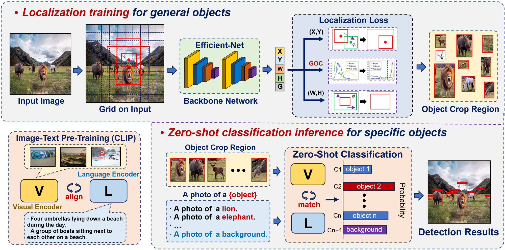
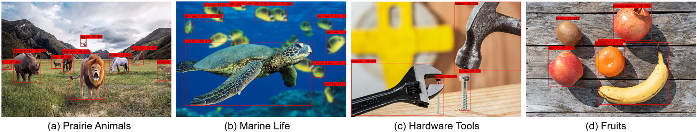

# Uni-YOLO: Large Model Guided YOLO for Robotic Universal Detection in the Open World
Xudong Wang, Xi’ai Chen *, Huijie Fan, Yandong Tang, Yang Cong, Zhi Han  
  
The State Key Laboratory of Robotics, Shenyang Institute of Automation, Chinese Academy of Sciences, and also University of Chinese Academy of Sciences (UCAS). (e-mail: wangxudong@sia.cn).
## Our work 

  &emsp;&emsp; 

In this work, we propose Uni-YOLO, a universal object detector for robots that has the ability to detect enormous categories in the open world.

  &emsp;&emsp; 

## Dependencies
* Python 3.8
* PyTorch 1.8.1 + cu111
* torchvision 0.9.1 + cu111
* numpy
* opencv-python
* skimage
* hiddenlayer
* matplotlib
* PIL
* math
* os
## Architecture
yolo.py: Training and testing main code.

uni_predict.py: Quick zero-shot test for a sample image.

utils: Some tools for network training and testing.

nets: The definition of network modules.

model_data: The candidate object categories and the Uni-YOLO model weight.

clip: The CLIP model for zero-shot classification.

## Quick Test
1. Please provide the categories for candidate objects. We have prepared a sample image and corresponding categories for quick test the detection performance. 
2. Please run the ``uni_predict.py`` and input the ``test.jpg``, then you will get the detection result.

* Other modules will be updated after publication.
